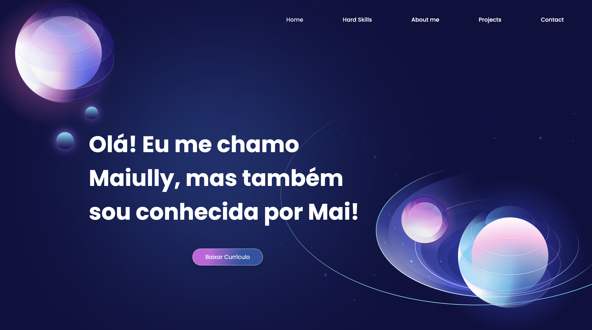

# Meu portfolio

✅ Projeto concluído

<a href="#breve-descrição">Breve Descrição</a> •
<a href="#tecnologias-utilizadas-na-construção-do-projeto">Tecnologias</a> •
<a href="#funcionalidades-do-projeto">Funcionalidades</a> •
<a href="#conceitos-explorados-no-projeto">Conceitos Explorados</a>

## Breve descrição

Site pessoal contendo o meu portfolio.

## Tecnologias utilizadas na construção do projeto

📍 HTML  
📍 Styled Components  
📍 JavaScript  
📍 React  
📍 React-icons  
📍 React-toastify  
📍 EmailJS

## Funcionalidades do projeto

<strong>Aplicação de página única com os seguintes recursos:</strong>

📍 Navbar responsivo.  
📍 Botão para baixar o meu currículo.  
📍 Link para o meu caderno de estudos.  
📍 Botão <i>scroll to top</i>.  
📍 Cards que dão acesso aos meus projetos no GitHub.  
📍 Link para o meu perfil no LinkedIn.  
📍 Formulário para envio de mensagens, no qual o usuário pode digitar o seu nome, e-mail, e mensagem.  
📍 Botões com links para o meu perfil no LinkedIn, para o meu perfil no GitHub, e para o meu canal no YouTube.

### Responsividade:

## Conceitos explorados no projeto

📍 Componentização no React.  
📍 Uso do UseState e UseEffect.  
📍 Rolagem suave entre as seções.  
📍 CSS in JS utilizando Styled Components.  
📍 Estilização condicional do Styled Components por meio do uso de propriedades.  
📍 Programação orientada a eventos por meio do addEventListener e onClick.  
📍 Uso do serviço online EmailJS para integrar o envio de e-mails.  
📍 Uso de notificações para informar o usuário sobre o envio da sua mensagem por meio do uso da biblioteca React-toastify.  
📍 Responsividade.
